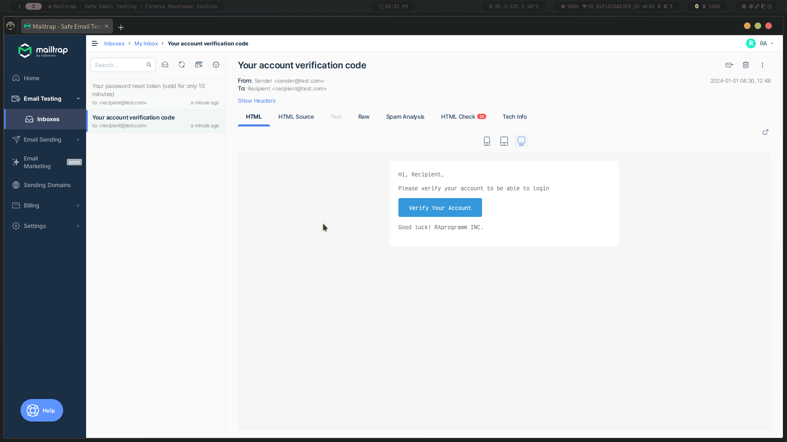
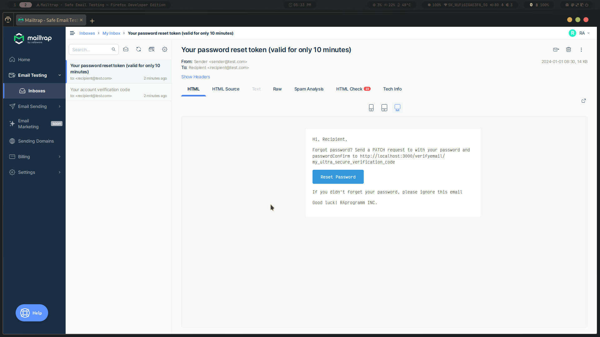

# Rust SMTP Email Sender

<p>This Rust application demonstrates sending verification codes and password reset tokens via email.</p>

<!--toc:start-->

- [Overview](#overview)
- [Setup](#setup)
- [Usage](#usage)
- [Project Structure](#project-structure)
- [Check how it works](#check-how-it-works)
- [Screenshots](#screenshots)
<!--toc:end-->

## Overview

<p>This project utilizes Rust to send emails using the <code>email</code> module. It initializes email configurations through the <code>config</code> module and sends verification codes and password reset tokens to users via SMTP.</p>

## Setup

> I'll show you how to do it with terminal command in linux.

1. [Download the repository](https://downgit.evecalm.com/#/home?url=https://github.com/RAprogramm/rust_study/tree/main/send-emails-smtp).

2. Go to your download folder.

   > for example
   >
   > ```sh
   > cd  ~/Downloads
   > ```

3. Extract project from ZIP archive.

   > in Downloads folder
   >
   > ```sh
   > unzip send-emails-smtp.zip
   > ```

4. Enter the project.

   > after extracting
   >
   > ```sh
   > cd send-emails-smtp
   > ```

5. Create a `.env` file with the following environment variables (use `example.env` as a reference):

```dotenv
SMTP_HOST=your_smtp_host
SMTP_PORT=your_smtp_port
SMTP_USER=your_smtp_user
SMTP_PASS=your_smtp_password
SMTP_FROM=sender_email_address
SMTP_TO=recipient_email_address
```

> This `example.env` file contains placeholder values for SMTP configuration. Create your `.env` file using this as a template and fill it with your actual SMTP configuration values.

## Usage

<p>To run the application, execute:</p>

```sh
make run
```

<p>To generate documentation and open it in browser, run:</p>

<pre><code>make doc</code></pre>

## Project Structure

<ul>
    <li><code>config</code>: Module for managing email configuration.</li>
    <li><code>email</code>: Module for handling email sending functionality.</li>
    <li><code>main.rs</code>: Contains the main application logic for sending emails.</li>
</ul>

## Check how it works

> When working in a development environment, it is advisable to utilize a test SMTP provider such as [Mailtrap](https://mailtrap.io/) to capture test emails instead of sending them to real users. This approach allows you to preview how the emails will appear when received by actual users and make any necessary adjustments.

To capture all the development emails, follow these steps:

1. Begin by creating a new account on [Mailtrap](https://mailtrap.io/) if you haven’t done so already. Once completed, sign in using your credentials, unless you were automatically signed in.
2. On the left sidebar, navigate to the ‘Email Testing‘ menu and click on the ‘Inboxes‘ link.
3. Within the inboxes page, create a new inbox by selecting the ‘Add Inbox‘ button. Provide a name for the inbox and click ‘Save‘ to create it.
4. After the inbox is created, locate the gear icon in the Action section and click on it to access the settings page.
5. On the settings page, find the ‘Show Credentials‘ link and click on it to expand the dropdown. You will find the SMTP credentials within. Copy these credentials.
6. Finally, add the copied SMTP credentials to your .env file.

## Screenshots




